# Android USB Timing Results
Below are the results for two different methods of setting the output state on the Teensy using a USB HID protocol with Interrupt Transfer endpoints.
NOTE: THE PROVIDED CODE DOES NOT NECESSARILY FOLLOW ANY BEST PRACTICIES AND IS SIMPLY JUST ENOUGH TO GET THE TESTS RUNNING STABLY

## Busy Wait
This method sets the state of the pin, and then simply polls the current time until the desired period has elapsed.

```Java
for (int i=0; i<20; i++) {
    bytes[0] = 1;
    connection.bulkTransfer(outendpoint, bytes, bytes.length, timeout);
    myWait(5);
    Log.d(TAG, "Blink");
    bytes[0] = 0;
    connection.bulkTransfer(outendpoint, bytes, bytes.length, timeout);
    myWait(5);
}

...

/* Spin wait */
public void myWait(long msec) {
    long start = System.currentTimeMillis();
    while ((System.currentTimeMillis()-start) < msec) { }
}
```

### No wait (myWait commented out)
With no waiting, the throughput characteristics can be observed.  From this test, it appears that it takes a minimum of about 4 msec to transfer the data.

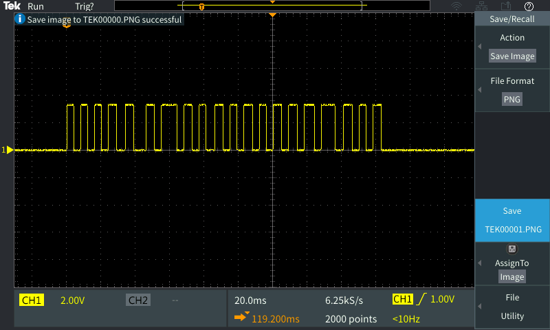
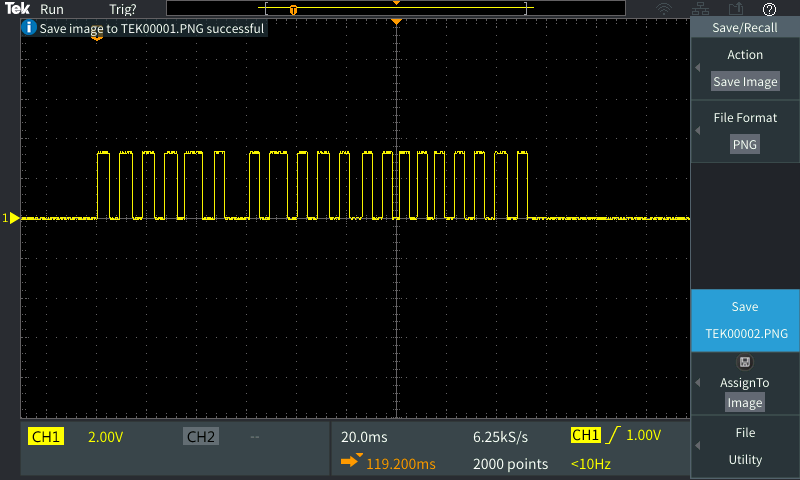

### 20 Msec wait
With a 20 msec wait, the output is relatively more stable but will still have jitter characteristics that may not be desired.

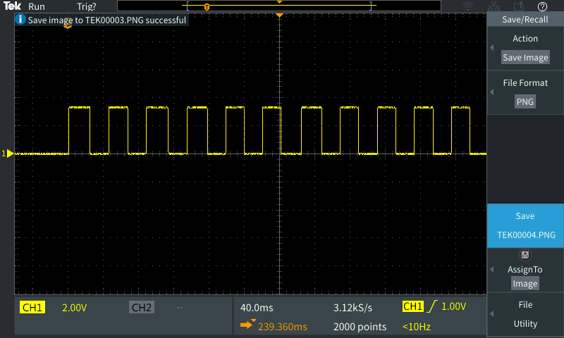
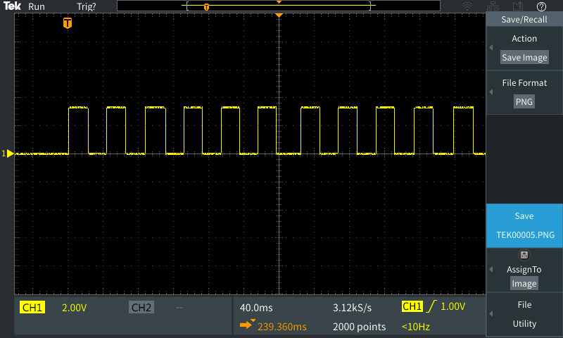

### 10 Msec wait
With a 10 msec wait, the jitter characteristics are more emphasized.  The output seems relatively consistent, but there are several occasions where the delay is up to 12 msec
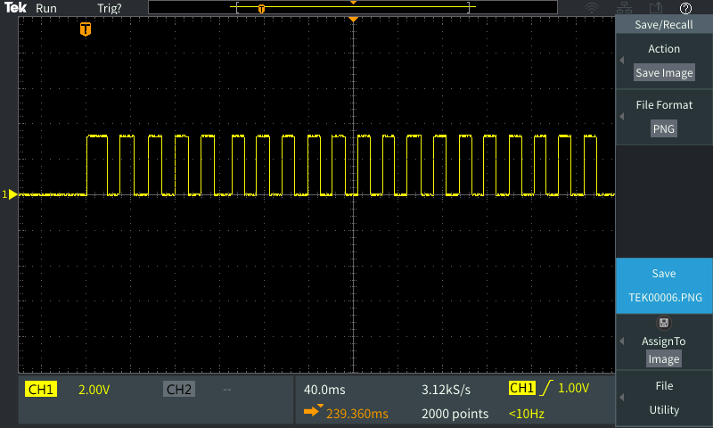
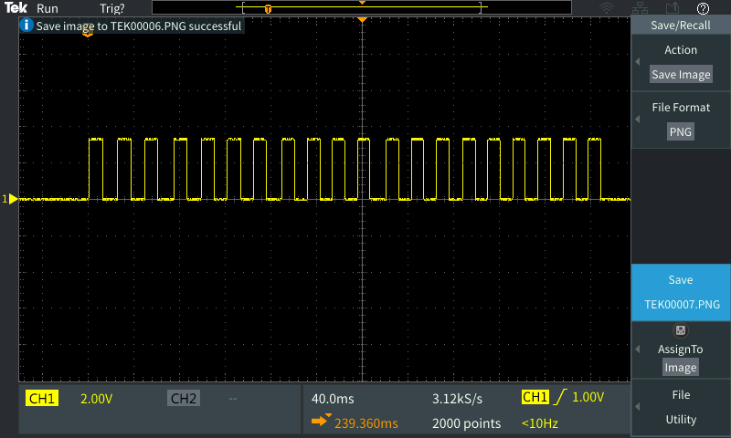


### 5 Msec wait
With a 5 msec wait, the jitter characteristics are even more emphasized.  The consistent timing appears to break down around this point, which is expected

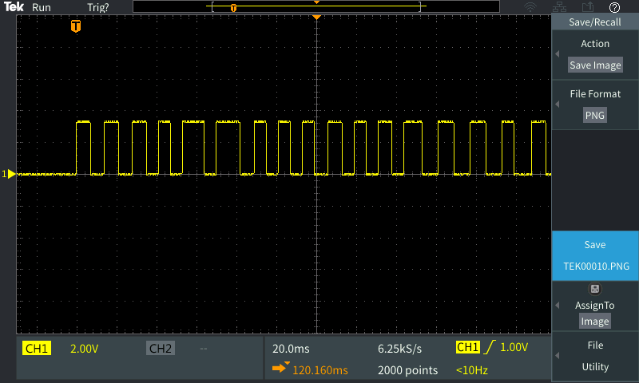
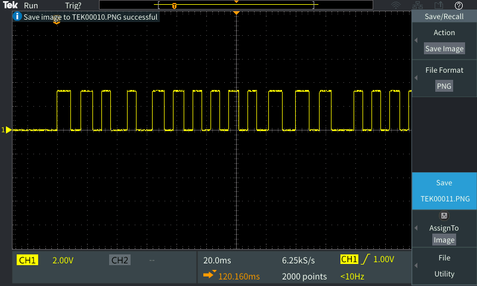

##Java Scheduled Task
In an attempt to get better periodic consistency, I tested setting the output using the built in Timer class to schedule a transfer at particular periods

```Java
myTimer.scheduleAtFixedRate(new myBlinkTask(), 0, 20);

...

public class myBlinkTask extends TimerTask {
    @Override
    public void run() {
      if (currCount < maxCount) {
          if (currCount%2 == 1) {
              bytes[0] = 0;
          } else {
              bytes[0] = 1;
          }
          connection.bulkTransfer(outendpoint, bytes, bytes.length, 100);
          currCount++;
      } else {
          Log.d(TAG, "Done Blinking");
          this.cancel();
      }
    }
};
```

### 20 Msec period
With a 20 msec scheduled period, the timing characteristics appear to be very good.  Although there can be up to about 4 msec of latency before the transfer is received, it appears that all of the deadlines are being met.


### 10 Msec period
With a 10 msec scheduled period, the received data appears to be relatively consistent and most deadlines are met with up to about 4 msec of latency, but an occasional deadline is entirely missed. Depending on the use case, this may or may not be acceptable.

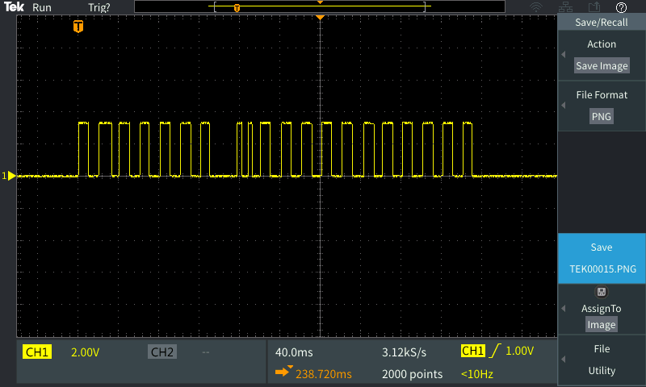


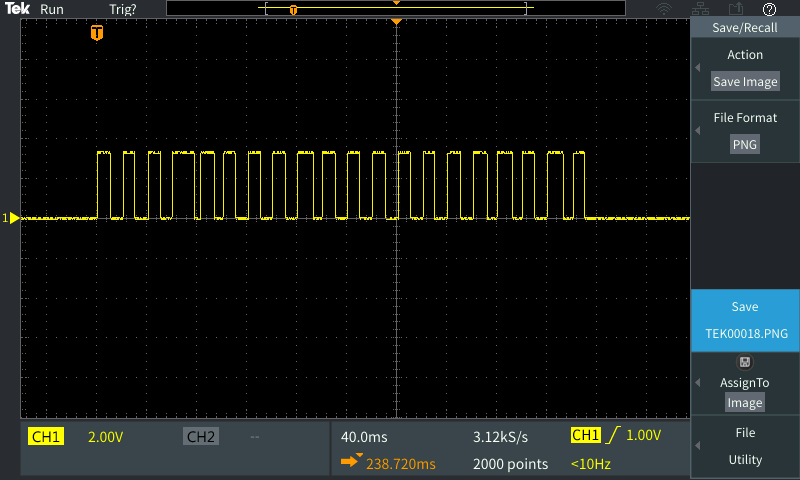

### 5 Msec period
With a 5 msec scheduled period, most of the deadlines are still met, but deadlines are more frequently entirely missed (do not execute) or push back other scheduled transfers.


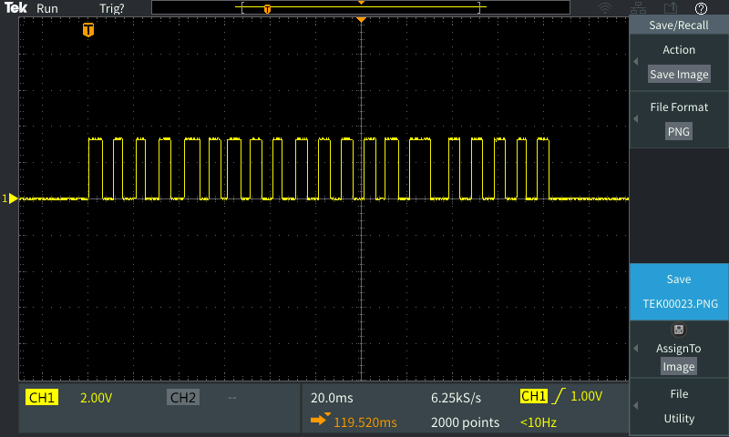
